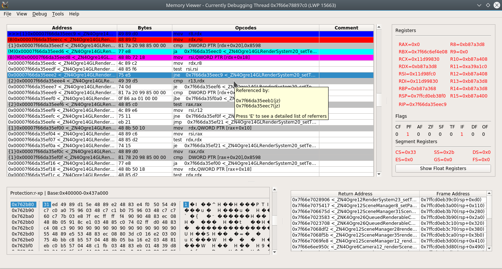
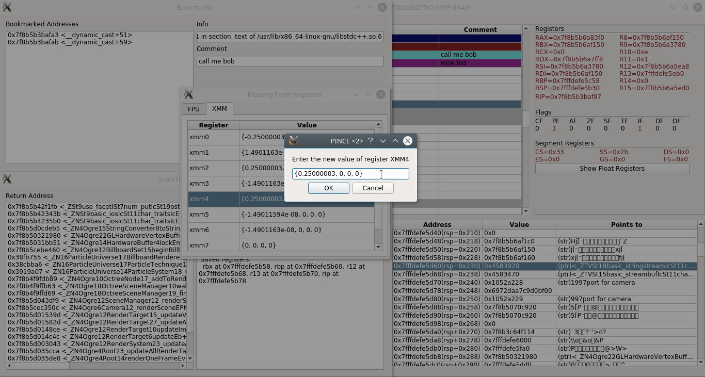
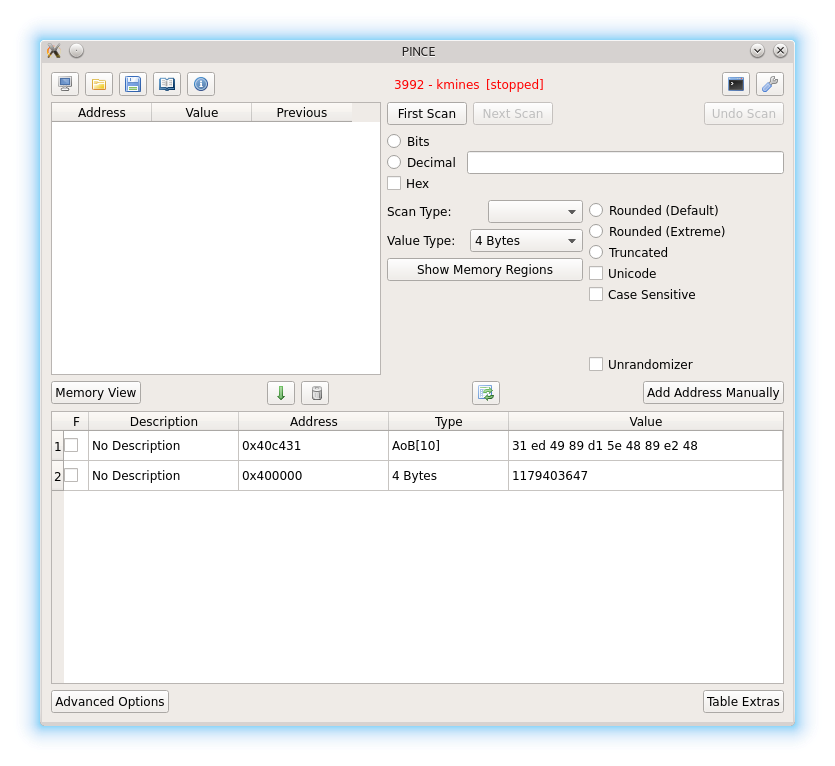
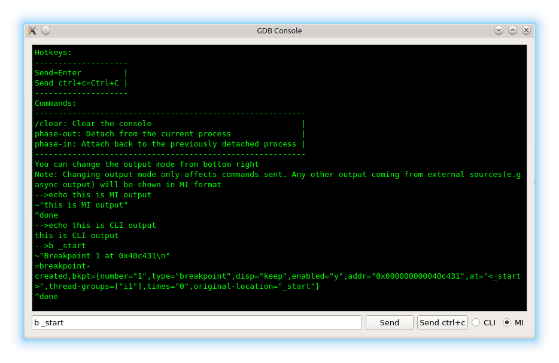
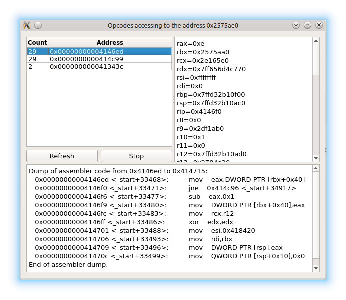
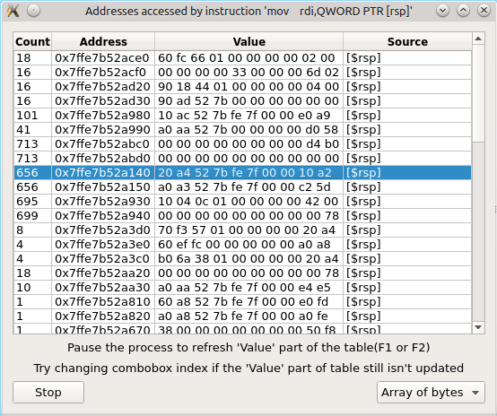
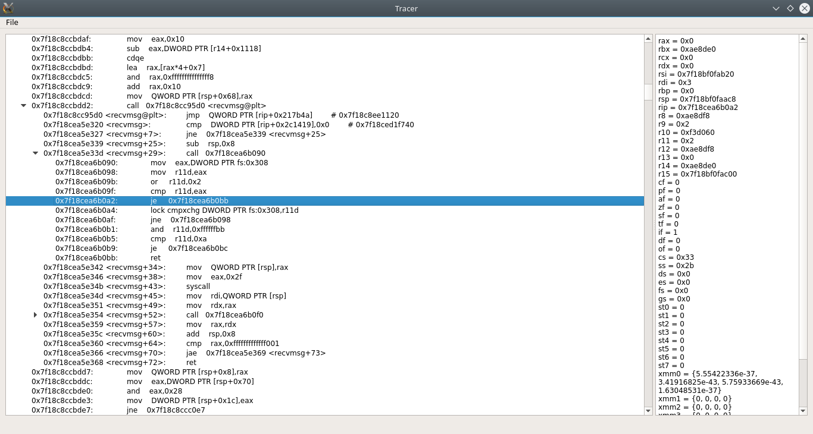

#PINCE  
PINCE is a front-end/reverse engineering tool for the GNU Project Debugger (GDB), focused on games. But it can be used for any reverse-engineering related stuff. PINCE is an abbreviation for "PINCE is not Cheat Engine". PINCE's GUI is heavily "inspired(;D)" by Cheat Engine. PINCE is in development right now, read features part of the project to see what is planned and what is done for now. Also, please read [Wiki Page](https://github.com/korcankaraokcu/PINCE/wiki) of the project to understand how PINCE works.  
  
*Disclaimer: Do not trust to any source other than [Trusted Sources](#trusted-sources) that claims to have the source code or package for PINCE and remember to report them* <em>**immediately**</em>  
  
Pre-release screenshots:  







#Features  
- **Memory searching** **[Planned]**  (The plan is to use libscanmem by wrapping it with a gdb python script)
- **Variable Inspection&Modification** **[Done/Basic]**
  * **CheatEngine-like value type support:** Byte to 8 Bytes, Float, Double, Strings(including utf-8 and zero-terminate strings), Array of Bytes **[Done]**
  * **Symbol Recognition:** Check GDB expressions in the Wiki page **[Done]**
  * **Automatic Variable Allocation:** Check GDB expressions in the Wiki page **[Done]**
  * **Dynamic Address Table:** Drag&drop rows, ctrl+c&ctrl+v between independent PINCE processes, clipboard text analysis(PINCE will try to analyze the contents of the current clipboard and try to pick data from it to convert for address table) **[Planned]**
  * **Manual Address Table Update:** **[Done]**
  * **Smart casting:** PINCE lets you modify multiple different-type values together as long as the input is parsable. All parsing/memory errors are directed to the terminal **[Done]**
  * **Continuous Address Table Update:** You can adjust update timer or cancel updating by modifying settings. Non-stop version is Postponed\Quarterway Done **[Done\Only works when the inferior is stopped]**
  * **Variable Locking:** PINCE lets you freeze(constantly write a value to memory cell) variables **[Postponed\Quarterway Done]**
  * *Postpone reason:* These two features requires thread injection to the target or gdb and PINCE's injection methods are not perfect yet, I've already spent more(read:WAY MORE) time than I should on this, these features are not vital for now, also you have got the options to manually update the table and set the value manually already
- **Memory View** **[Done/Basic]**
  * **Infinite Scrolling:** PINCE automatically disassembles the next available instruction(s) on mouse wheel/scrollbar move. Instruction count can be changed from settings. Hex View also supports this feature **[Done]**
  * **Following:** If you press [space], PINCE automatically analyzes the selected instruction and if any location changing instruction is found, PINCE disassembles the address that's pointed by the instruction **[Done]**
  * **Travel History:** PINCE records your previous location when you jump to an address explicitly(e.g by pressing [space] or using "Go to expression" etc.). Right click->Back to go back to your previous location(s) **[Done]**
  * **Bookmarking:** Bookmark menu is dynamically created when right clicked in the disassemble screen. So unlike Cheat Engine, PINCE lets you set unlimited number of bookmarks. List of bookmarks can also be viewed from View->Bookmarks in the MemoryView window. Commenting on an address automatically bookmarks it. **[Done]**
  * **Modify on the fly:** PINCE lets you modify registers on the fly. Unlike CE, you can also change XMM and FPU registers. Check GDB expressions in the Wiki page for additional information **[Done]**  
- **Debugging** **[Done]**
  * Has basic debugging features such as stepping, stepping over, execute till return, break, continue. Also has breakpoints, watchpoints and breakpoint conditions. Has advanced debugging utilities such as Watchpoint/Breakpoint Tracking and Tracing
  * **Chained Breakpoints:** Just like CE, PINCE allows you to set multiple, connected breakpoints at once. If an event(such as condition modification or deletion) happens in one of the breakpoints, other connected breakpoints will get affected as well **[Done]**
  * **Watchpoint Tracking:** Allows you to see which instructions have been accessing to the specified address, just like "What accesses/writes to this address" feature in CE **[Done]**
  * **Breakpoint Tracking:** Allows you to track down addresses calculated by the given register expressions at the specified instruction, just like "Find out what addresses this instruction accesses" feature in CE with a little addon, you can enter multiple register expressions, this allows you to check the value of "esi" even if the instruction is something irrelevant like "mov [eax],edx" **[Done]**
  * **Tracing:** Almost the same with CE. Created from scratch with shittons of custom features instead of using gdb's trace&collect commands because some people have too much time on their hands **[Done]**
  * **Collision Detection:** GDB normally permits setting unlimited watchpoints next to each other. But this behaviour leads to unexpected outcomes such as causing GDB or the inferior become completely inoperable. GDB also doesn't care about the number(max 4) or the size(x86->max 4, x64->max 8) of hardware breakpoints. Fortunately, PINCE checks for these problems whenever you set a new breakpoint and detects them before they happen and then inhibits them in a smart way. Lets say you want to set a breakpoint in the size of 32 bytes. But the maximum size for a breakpoint is 8! So, PINCE creates 4 different breakpoints with the size of 8 bytes and then chains them for future actions **[Done]**
- **Code Injection** **[Working on it]**
  * **Run-time injection:** Only .so injection is supported for now. In Memory View window, click Tools->Inject .so file to select the .so file. An example for creating .so file can be found in "libPINCE/Injection/". PINCE will be able to inject single line instructions or code caves in near future **[Partially Done?]**
- **GDB Console** **[Done]**
  * Is the power of PINCE not enough for you? Then you can use the gdb console provided by PINCE, it's on the top right in main window
- **Simplified/Optimized gdb command alternatives** **[Working on it]**
  * Custom scripts instead of using gdb's x command for reading memory **[Done]**
  * Custom scripts instead of using gdb's set command for modifying memory **[Done]**
- **libPINCE- A reusable python library** **[Current Status:*Reusable*]**
  * PINCE provides a reusable python library. I'll write a fully-documented guide about how to use it as soon as the project finishes at basic level. Until that moment, I'll keep developing libPINCE as modular as possible  
- **Automatic Trainer Generation:** **[Planned]**  
  * PINCE provides a trainer auto-generated from current address table on demand by using libPINCE and PyQT5 together

#Installing Automatically
Just run ```sudo sh install.sh``` in the PINCE directory. Install script currently supports Ubuntu and Debian. For Archlinux, use the [AUR package](https://aur.archlinux.org/packages/pince-git/) instead. See below if the automatic installation fails.
#Installing Manually  
To install PINCE, run this command chain then compile gdb:  
  
```
sudo apt-get install python3-setuptools  
sudo apt-get install python3-pip  
sudo apt-get install python3-pyqt5  
sudo pip3 install psutil  
sudo pip3 install pexpect  
```  
###**Compiling gdb with python support**  
Install the packages required for compiling gdb:
```
sudo apt-get install python3-dev  
sudo apt-get install gcc  
```
Then ```cd``` to the libPINCE folder and make a folder for gdb:  
```
cd libPINCE
mkdir -p gdb_pince
cd gdb_pince
```  
Download and extract the gdb source code:
```  
wget "http://ftp.gnu.org/gnu/gdb/gdb-7.11.1.tar.gz"
tar -zxvf gdb-7.11.1.tar.gz
cd gdb-7.11.1
```  
Then compile&install locally:
```  
CC=gcc ./configure --prefix=$(pwd) --with-python=python3 && make && sudo make -C gdb install
```  
Move the contents of gdb/data-directory to share/gdb in case of python part of gdb installation fails:
```  
sudo cp -R gdb/data-directory/* share/gdb/
```  
Finally, create .gdbinit file in home directory and add the line ```set auto-load safe-path /```  into it:
```  
cd
touch .gdbinit
echo "\n"$auto_load_command >> .gdbinit
```  
#Running PINCE  
Just run ```sh PINCE.sh``` in the PINCE directory

###For developers:  
```
sudo apt-get install qttools5-dev-tools (qt5 form designer)
sudo apt-get install pyqt5-dev-tools (pyuic5)
```
  
#History
- A few weeks till 17/01/2016 : Learned GDB, process of analysis
- 17/01/2016-22/01/2016 : Basic design, grasping of Python3 and Pyqt5, proof-testing
- 22/01/2016 : First commit
- 19/02/2016 : Moved to Github from Bitbucket
- 25/02/2016 : First successful implementation of thread injection[Update-08/05/2016 : PINCE now uses ```linux-inject``` as a secondary injection method]  
- 18/06/2016 : PINCE now supports all-stop mode instead of non-stop mode
- 21/06/2016 : Variable Inspection&Modification is finished  
- 21/08/2016 : Memory View is finished
- 24/08/2016 : PINCE no more uses linux-inject because of stability issues(a fix for the [race conditions in the inferior](https://github.com/gaffe23/linux-inject/issues/7) would be nice)
- 26/12/2016 : Debugging is finished

#License
GPLv3+. See COPYING file for details

#Contact Information
Korcan Karaokçu <korcankaraokcu@gmail.com>  
Çağrı Ulaş <cagriulas@gmail.com>  
Jakob <jakob@memeware.net>  

#Supported platforms
- **Platforms tested so far:**
  * Kubuntu 14.04 & 16.04(Also tested on x86 variants)
  * Debian 8.5
  * Archlinux(contact with [Çağrı Ulaş](https://github.com/cagriulas) or [Jakob](https://github.com/TsarFox))
- **Games&Applications tested so far:**
  * KMines
  * Torchlight 2
  * Skullgirls
  * Steam
  * Firefox
  * WINE Games
    * FTL
    * Undertale
    * Hearthstone(It interrupts itself with SIGUSR1 whenever continued, implementing signal passing on PINCE might be very useful in future)

#Trusted Sources
  * This page and other github forks
  * [AUR package for Archlinux](https://aur.archlinux.org/packages/pince-git/)
