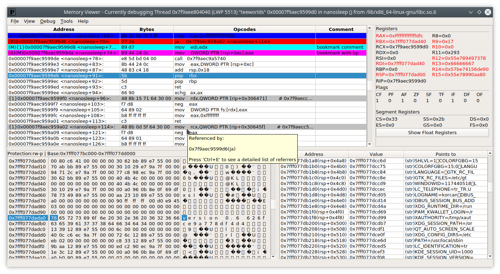
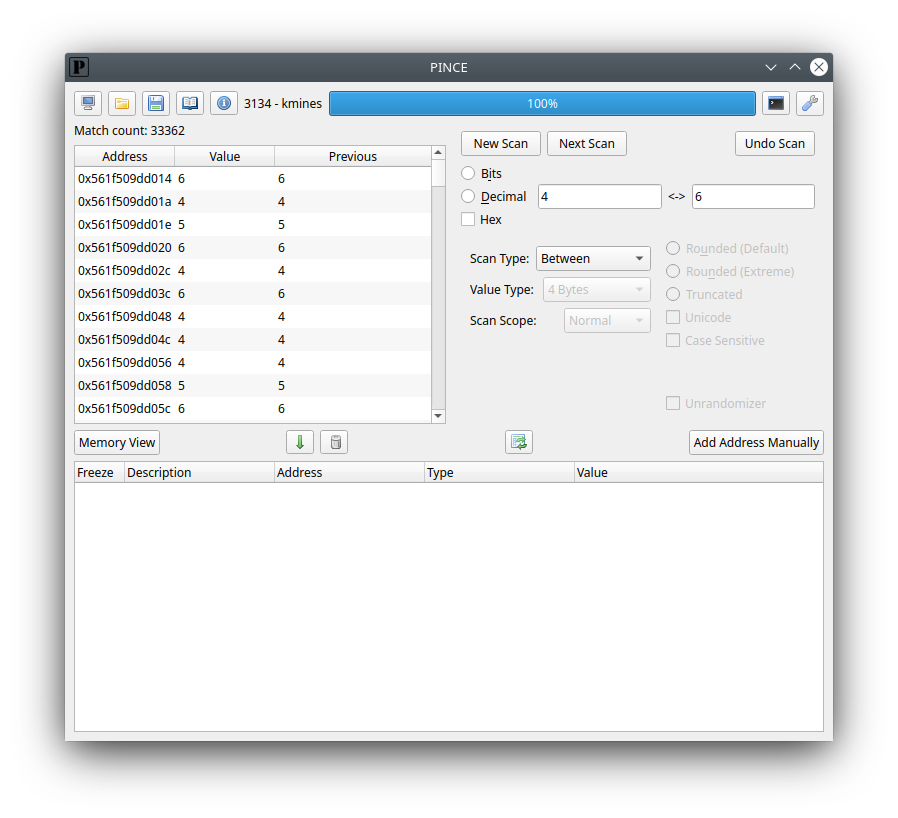
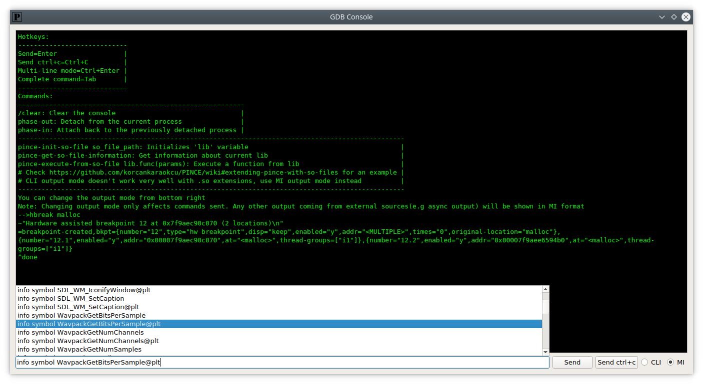
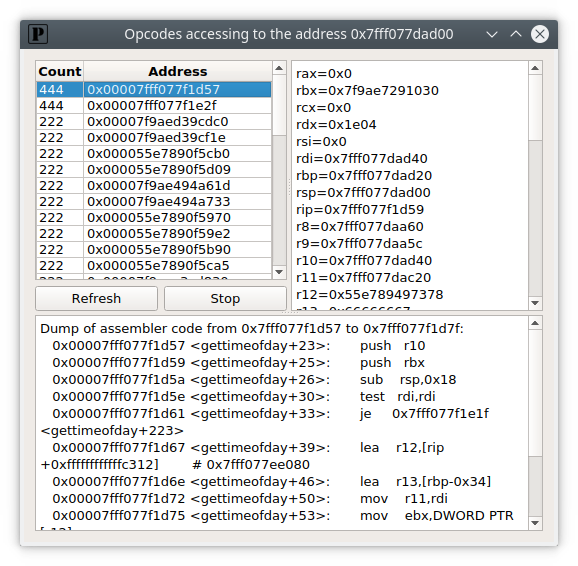
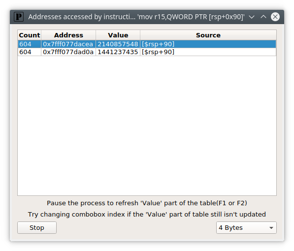
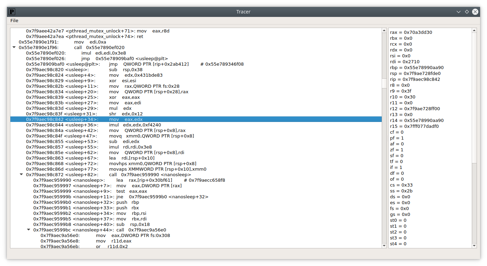
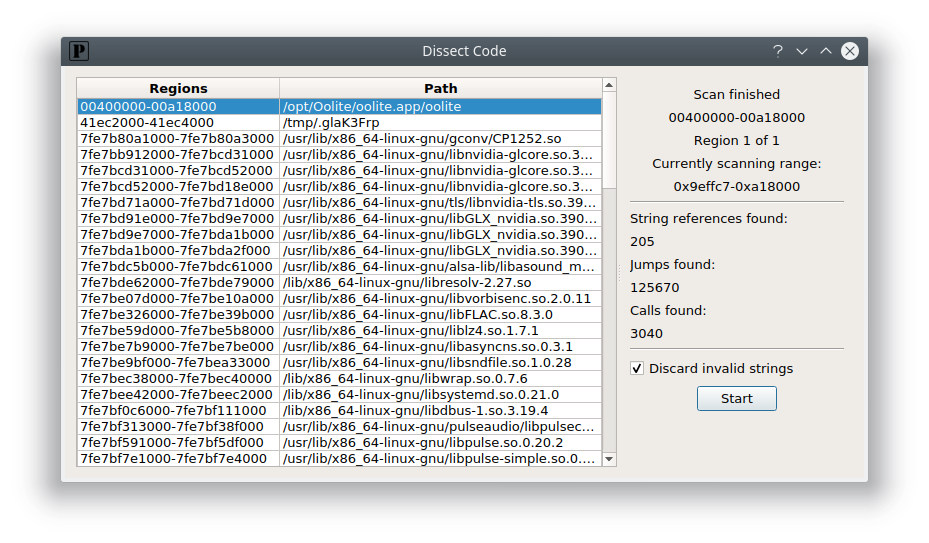
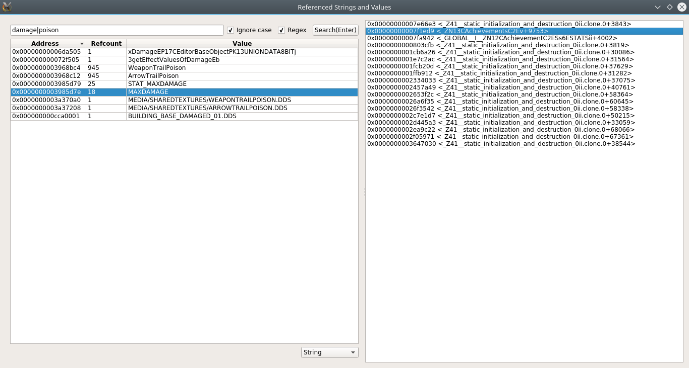
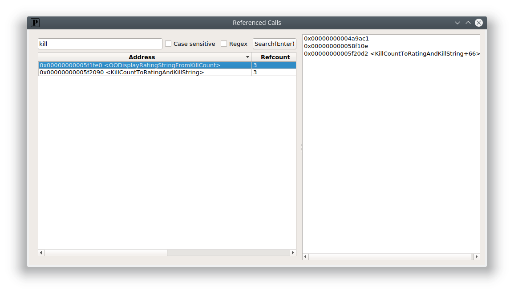

# PINCE
<!---
TODO: Include build status with the title when test coverage increases and Travis is maintained
[](https://travis-ci.org/korcankaraokcu/PINCE)
-->
PINCE is a front-end/reverse engineering tool for the GNU Project Debugger (GDB), focused on games. However, it can be used for any reverse-engineering related stuff. PINCE is an abbreviation for "PINCE is not Cheat Engine". PINCE is in development right now, read [Features](#features) part of the project to see what is done and [Roadmap](#current-roadmap) part to see what is currently planned. Also, please read [Wiki Page](https://github.com/korcankaraokcu/PINCE/wiki) of the project to understand how PINCE works.  

### [Feel free to join our discord server!](https://discord.gg/KCNDp9m)  

*Disclaimer: Do not trust to any source other than [Trusted Sources](#trusted-sources) that claims to have the source code or package for PINCE and remember to report them **immediately***

*Disclaimer: **YOU** are responsible for your actions. PINCE does **NOT** take any responsibility for the damage caused by the users*

Pre-release screenshots:  










# Features  
- **Memory searching:** PINCE uses [libscanmem](https://github.com/scanmem/scanmem) to search the memory efficiently **[Done]**
- **Variable Inspection&Modification** **[Done/Basic]**
  * **CheatEngine-like value type support:** Byte to 8 Bytes, Float, Double, Strings(including utf-8, utf-16, utf-32 and zero-terminate strings), Array of Bytes **[Done]**
  * **Symbol Recognition:** See [here](https://github.com/korcankaraokcu/PINCE/wiki/About-GDB-Expressions) **[Done]**
  * **Automatic Variable Allocation:** See [here](https://github.com/korcankaraokcu/PINCE/wiki/About-GDB-Expressions) **[Done]**
  * **Dynamic Address Table:** Supports drag&drop, recursive copy&pasting&inserting and many more **[Done]**
  * **Manual Address Table Update:** **[Done]**
  * **Smart casting:** PINCE lets you modify multiple different-type values together as long as the input is parsable. All parsing/memory errors are directed to the terminal **[Done]**
  * **Continuous Address Table Update:** You can adjust update timer or cancel updating by modifying settings. Non-stop version is Postponed\Quarterway Done **[Done\Only works when the inferior is stopped]**
  * **Variable Locking:** PINCE lets you freeze(constantly write a value to memory cell) variables **[Done]**
- **Memory View** **[Done/Basic]**
  * **Infinite Scrolling:** PINCE automatically disassembles the next available instruction(s) on mouse wheel/scrollbar move. Instruction count can be changed from settings. Hex View also supports this feature **[Done]**
  * **Dissect Code:** You can dissect desired memory regions to find referenced calls, jumps and strings. Disassemble screen will automatically handle the referenced data and show you if there's a referenced address in the current dissasemble view. It can be used from Tools->Dissect Code in the MemoryView window. Using its hotkey instead in the MemoryView window automatically dissects the currently viewed region. You can separately view referenced calls and strings after the search from View->Referenced Calls/Strings. *Note: If you decide to uncheck 'Discard invalid strings' before the search, PINCE will try to search for regular pointers as well* **[Done]**
  * **Bookmarking:** Bookmark menu is dynamically created when right clicked in the disassemble screen. So unlike Cheat Engine, PINCE lets you set unlimited number of bookmarks. List of bookmarks can also be viewed from View->Bookmarks in the MemoryView window. Commenting on an address automatically bookmarks it. **[Done]**
  * **Modify on the fly:** PINCE lets you modify registers on the fly. Unlike CE, you can also change XMM and FPU registers. Check [GDB expressions in the Wiki page](https://github.com/korcankaraokcu/PINCE/wiki/About-GDB-Expressions) for additional information **[Done]**
  * **Opcode Search:** You can search opcodes with python regular expressions. To use this feature, click Tools->Search Opcode in the MemoryView window. **[Done]**  
- **Debugging** **[Done/Basic]**
  * Has basic debugging features such as stepping, stepping over, execute till return, break, continue. Also has breakpoints, watchpoints and breakpoint conditions. Has advanced debugging utilities such as Watchpoint/Breakpoint Tracking and Tracing
  * **Chained Breakpoints:** Just like CE, PINCE allows you to set multiple, connected breakpoints at once. If an event(such as condition modification or deletion) happens in one of the breakpoints, other connected breakpoints will get affected as well **[Done]**
  * **Watchpoint Tracking:** Allows you to see which instructions have been accessing to the specified address, just like "What accesses/writes to this address" feature in CE **[Done]**
  * **Breakpoint Tracking:** Allows you to track down addresses calculated by the given register expressions at the specified instruction, just like "Find out what addresses this instruction accesses" feature in CE with a little addon, you can enter multiple register expressions, this allows you to check the value of "esi" even if the instruction is something irrelevant like "mov [eax],edx" **[Done]**
  * **Tracing:** Almost the same with CE. But unlike CE, you can stop tracing whenever you want. Created from scratch with shittons of custom features instead of using gdb's trace&collect commands because some people have too much time on their hands **[Done]**
  * **Collision Detection:** GDB normally permits setting unlimited watchpoints next to each other. But this behaviour leads to unexpected outcomes such as causing GDB or the inferior become completely inoperable. GDB also doesn't care about the number(max 4) or the size(x86->max 4, x64->max 8) of hardware breakpoints. Fortunately, PINCE checks for these problems whenever you set a new breakpoint and detects them before they happen and then inhibits them in a smart way. Lets say you want to set a breakpoint in the size of 32 bytes. But the maximum size for a breakpoint is 8! So, PINCE creates 4 different breakpoints with the size of 8 bytes and then chains them for future actions **[Done]**
- **Code Injection** **[Working on it]**
  * **Run-time injection:** Only .so injection is supported for now. In Memory View window, click Tools->Inject .so file to select the .so file. An example for creating .so file can be found in "libPINCE/Injection/". PINCE will be able to inject single line instructions or code caves in near future **[Partially Done?]**
- **GDB Console** **[Done]**
  * Is the power of PINCE not enough for you? Then you can use the gdb console provided by PINCE, it's on the top right in main window
- **Simplified/Optimized gdb command alternatives** **[Working on it]**
  * Custom scripts instead of using gdb's x command for reading memory **[Done]**
  * Custom scripts instead of using gdb's set command for modifying memory **[Done]**
- **libPINCE- A reusable python library**
  * PINCE provides a reusable python library. You can either read the code or check Reference Widget by clicking Help->libPINCE in Memory Viewer window to see docstrings. Contents of this widget is automatically generated by looking at the docstrings of the source files. PINCE has a unique parsing technique that allows parsing variables. Check the function get_comments_of_variables in SysUtils for the details. This feature might be replaced with Sphinx in the future
- **Extendable with .so files at runtime**
  * See [here](https://github.com/korcankaraokcu/PINCE/wiki/Extending-PINCE-with-.so-files)
- **Automatic Trainer Generation:** **[Planned]**  
  * PINCE provides a trainer auto-generated from current address table on demand by using libPINCE and PyQT5 together

# Installing
Clone this repo by running `git clone --recursive https://github.com/korcankaraokcu/PINCE` then run ```sudo sh install_pince.sh``` in the PINCE directory. For Archlinux, you can also use the [AUR package](https://aur.archlinux.org/packages/pince-git/) as an alternative.

If you like to uninstall PINCE, just delete this folder, almost everything is installed locally. Config and user files of PINCE can be found in "~/.config/PINCE", you can manually delete them if you want.

***Note:***
- GDB enhancements (peda, pwndbg, etc) that use a global gdbinit file might cause PINCE to misfunction at times. Please disable them or use them locally before starting PINCE

# Running PINCE  
Just run ```sh PINCE.sh``` in the PINCE directory

### For developers:  
```
sudo apt-get install qttools5-dev-tools (qt5 form designer)
sudo apt-get install pyqt5-dev-tools (pyuic5)
sudo pip3 install line_profiler (for performance testing)
```
How to use line_profiler: Add ```@profile``` tag to the desired function and run PINCE with ```sudo kernprof -l -v PINCE.py```
# History
- A few weeks till 17/01/2016 : Learned GDB, process of analysis
- 17/01/2016-22/01/2016 : Basic design, grasping of Python3 and Pyqt5, proof-testing
- 22/01/2016 : First commit
- 19/02/2016 : Moved to Github from Bitbucket
- 25/02/2016 : First successful implementation of thread injection[Update-08/05/2016 : PINCE now uses ```linux-inject``` as a secondary injection method]  
- 18/06/2016 : PINCE now supports all-stop mode instead of non-stop mode
- 21/06/2016 : Variable Inspection&Modification is finished(At basic level)  
- 21/08/2016 : Memory View is finished(At basic level)
- 24/08/2016 : PINCE no more uses linux-inject because of stability issues(a fix for the [race conditions in the inferior](https://github.com/gaffe23/linux-inject/issues/7) would be nice)
- 26/12/2016 : Debugging is finished(At basic level)  
- 19/05/2020 : libscanmem integration is complete, enjoy memory searching. Huge thanks to fisu, xk and 12345ieee (libscanmem team)  

# Current Roadmap
- Refactor file naming conventions(libPINCE->libpince, decide on snake_case or camelCase for modules etc)
- Create ```CONTRIBUTING.md``` and combine all non-tutorial notes within it
- Consider replacing read/write_memory_multiple functions with mem_handle&read/write_memory functions, this fixes the "read_memory_multiple follows a bad design pattern" step
- Implement non-stop Continuous Address Table Update feature
- Refactorize memory write/read functions
- - ReferencedStringsWidgetForm refreshes the cache everytime the comboBox_ValueType changes, this creates serious performance issues if total results are more than 800k. Only update the visible rows to prevent this(check ```disassemble_check_viewport``` for an example)
- - Implement same system for the TrackBreakpointWidgetForm if necessary. Do performance tests
- - Consider using a class instead of primitive return types to store the raw bytes. This also gets rid of the unnecessary parameter only_bytes. This class should also include a method to display None type as red '??' text for Qt
- - text_to_valuetype is a bad design pattern. Store the information inside the items of tableWidget_AddressTable instead
- - read_memory_multiple follows a bad design pattern, use named tuples or something like that
- - Provide an option to cut BOM bytes when writing to memory with the types UTF-16 and UTF-32
- - Put a warning for users about replacement bytes for non UTF-8 types
- - Extend string types with LE and BE variants of UTF-16 and UTF-32
- - Change comboBox_ValueType string order to be ... String_UTF-8 String_Others Array of Bytes
- - Implement a custom combobox class for comboBox_ValueType and create a context menu for String_Others item
- Indent docstrings properly like GDB_Engine.get_breakpoint_info does(independent from other steps)
- Implement "Investigate Registers" button to gather information about the addresses registers point to(independent from other steps)
- Implement selectionChanged signal of lineEdit_HexView
- Implement multi selection for HexView
- Add the ability to track down registers and addresses in tracer(unsure)(independent from other steps)
- Implement CE's Ultimap-like feature for tracing data, dissect code data and raw instruction list. Search for calls and store their hit counts to filter out the functions that haven't or have executed specific number of times. Implement a flexible input field for the execution count. For instance, 2^x only searches for hit counts 2, 4, 8 and so on, 3x only searches for 3, 6, 9 etc.(independent from other steps)([CE#358](https://github.com/cheat-engine/cheat-engine/issues/358))
- Extend search_referenced_strings with relative search
- Consider adding type guessing for the StackView(independent from other steps)
- Move GUI classes of PINCE.py to their own files
- Handle signals and internal errors that causes gdb to halt, such as SIGSEGV and overlapping breakpoints(independent from other steps)
- Use gdb python API breakpoints instead of breakpoint commands for optimization, also find a way to eliminate output coming from stepping commands such as ```stepi``` or ```nexti```(independent from other steps)
- Implement a psuedo-terminal for the inferior like edb does(independent from other steps)
- Implement libPINCE engine
- Implement auto-ESP&aimbot (depends on libPINCE engine)
- Try to optimize TrackBreakpoint and TrackWatchpoint return data structures further, adding an id field might simplify traversing of the tree, performance tests are required(independent from other steps)
- Extend tagging system to PINCE GUI functions
- Implement inject_with_advanced_injection(independent from other steps)
- Implement single-line code injection
- Implement multi-line code injection
- Break on/Catch signals and syscalls
- Move non-communication functions in GDB_Engine to ScriptUtils and create corresponding fields in GDB_Engine and GDBCommandExtensions automatically. This lets entire functionality of libPINCE to be used with both python scripts and gdb python scripts, thus allowing it to be used as a plugin for projects such as radare2
- Flowcharts based on disassembled output
- Automatic function bypassing(make it return the desired value, hook specific parts etc.)
- Implement speedhack(independent from other steps)
- Implement unrandomizer(independent from other steps)
- Implement pointer-scan
- Write at least one test for each function in libPINCE
- Migrate to Sphinx documentation from the custom libPINCE documentation(independent from other steps)
- Embedded tutorial videos
- Super-Uber-Rad credits roll with chiptune tunes
- Implement extra MemoryViewerWindow tabs(independent from other steps)
- ~~Consider removing the command file layer of IPC system for GDB_Engine.send_command to speed up things~~(independent from other steps)[Update-29/04/2018 : Delaying this until GDB/MI implements a native multiline command feature or improves ```interpreter-exec``` command to cover every single multiline command type(including ```define``` commands)]
- Implement thread info widget
- Add ability to change logo and other assets if people contribute more than one asset per usage. Also consider using [PINCE-media](https://github.com/korcankaraokcu/PINCE-media) for development if needed(independent from other steps)
- Implement developer mode in settings. Developer mode will include features like dissection of GUI elements on events such as mouse-over(independent from other steps)
- Add ability to include non-absolute calls for dissect code feature(i.e call rax). Should be considered after the first version release. Might be useful for multi-breakpoint related features
- Implement toggling of arrows for easier navigation for dissected regions(independent from other steps)
- Provide information about absolute addresses in disassemble screen(independent from other steps)
- Use type hints(py 3.5) and variable annotations(py 3.6) when support drops for older systems(independent from other steps)
- All tables that hold large amount of data should only update the visible rows(check ```disassemble_check_viewport``` for an example)(independent from other steps)
- Add different kinds of themes and the ability to change between them on runtime. Implement dark theme first. Also add the ability to create a custom theme and modify the existing ones(independent from other steps)

# License
GPLv3+. See COPYING file for details

# Contact Information
Korcan Karaokçu([korcankaraokcu](https://github.com/cagriulas)) <korcankaraokcu@gmail.com>  
Çağrı Ulaş([cagriulas](https://github.com/cagriulas)) <cagriulas@gmail.com>  
Jakob Kreuze([TsarFox](https://github.com/TsarFox)) <jakob@memeware.net>  
Gibus <lilac66.dev@gmail.com>  

# Supported platforms
- Ubuntu and its flavors, actively tested on Kubuntu
- Debian
- Kali Linux
- Parrot OS
- Linux Mint (install the package "python3-psutil" if you encounter ImportError or NameError, thanks Gibus)
- Archlinux(tag [cagriulas](https://github.com/cagriulas) or [TsarFox](https://github.com/TsarFox) when creating an issue)

# Trusted Sources
  * [Official github page](https://github.com/korcankaraokcu/PINCE)
  * [AUR package for Archlinux](https://aur.archlinux.org/packages/pince-git/)
