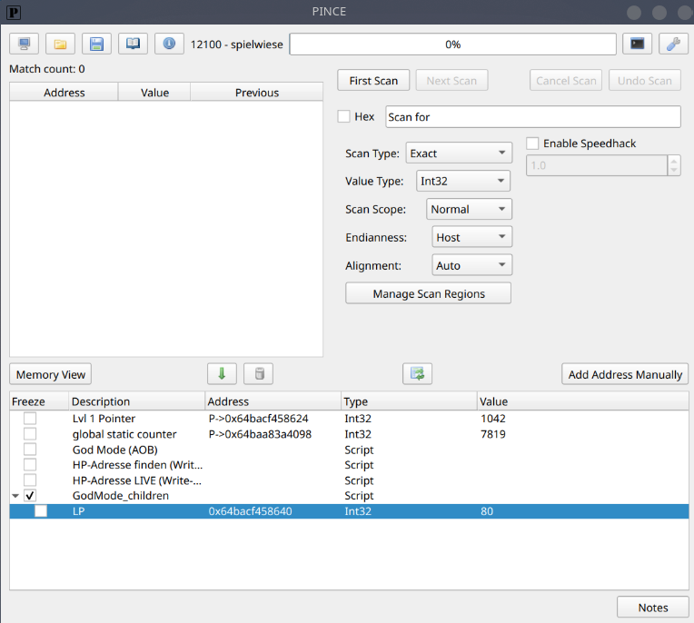

Script Entries and Script-Defined Children
==========================================

PINCE cheat tables can hold **script entries**: rows backed by a Libpince Engine
script instead of a frozen value. Toggling the row's checkbox runs the script's
``[ENABLE]`` or ``[DISABLE]`` section. A script entry can also declare **child
rows** that PINCE builds under it after a successful enable.

Script entries
--------------

A script entry runs Python inside PINCE against the attached process. The script
is split into sections by two case-insensitive tag lines, ``[ENABLE]`` and
``[DISABLE]``:

* Code before the first tag is a *prelude* that runs before both halves.
* ``[ENABLE]`` runs when the row is checked, ``[DISABLE]`` when it is unchecked.
* The two halves share a namespace that persists for the session, so a value
  assigned in ``[ENABLE]`` is still available in a later ``[DISABLE]`` run.

Scripts call the Libpince helper API (memory read/write, ``patch``/``nop``,
``aobscan``, register access, and more). See
:mod:`GUI.Widgets.LibpinceEngine.LibpinceEngine` for the full helper surface.

Creating a script entry
~~~~~~~~~~~~~~~~~~~~~~~~~

Open the Memory Viewer, then **Tools → Libpince Engine**, write or paste the
script, and use **Send to cheat table**. The new row's checkbox then toggles
``[ENABLE]`` / ``[DISABLE]``. Double-clicking an existing script row reopens it in
the engine.

Script-defined children
------------------------

A script entry can show child rows under its own row. The design is
**pull + snapshot**: the script never touches the table itself; it only fills a
``children`` list, and PINCE reads that list once after a successful ``[ENABLE]``,
builds the corresponding rows, and expands the parent row.

How it works
~~~~~~~~~~~~~

* The author sets a ``children`` list during ``[ENABLE]``. The **number and
  names** of children are a snapshot taken right after enable and stay fixed.
* Each child's **address** and **value** may keep changing at runtime. In
  particular, an address that only becomes known later (for example after a
  breakpoint fires) is picked up automatically by the table refresh.
* Children are **ephemeral**: they are never written to the ``.pct`` file and are
  removed again on ``[DISABLE]``. No cheat-table format change is involved.
* All table changes happen on the GUI thread. The script stays passive and never
  touches Qt objects, which keeps the feature thread-safe even when the script
  uses a background poller.

The ``children`` list
~~~~~~~~~~~~~~~~~~~~~~~

Each item in ``children`` is a dict:

.. list-table::
   :header-rows: 1
   :widths: 20 30 50

   * - Field
     - Type
     - Meaning
   * - ``name``
     - ``str`` (required)
     - Display name of the child row.
   * - ``address``
     - ``str`` | ``int`` | ``None`` | callable
     - Address expression, or a 0-argument callable returning one (or ``None``
       while unknown). A callable is polled by the table refresh, so a
       late-known address appears on its own.
   * - ``size``
     - ``int`` (1, 2, 4, 8; default 4)
     - Integer value-type width.
   * - ``value_type``
     - :class:`libpince.typedefs.ValueType`
     - Explicit value type; overrides ``size``.
   * - ``script``
     - ``str``
     - Makes the child itself a script entry (recursive). Its ``[ENABLE]`` runs
       only when the user checks it manually.

.. note::

   A callable ``address`` getter must be cheap and side-effect free, because it
   is polled on every table refresh. Do the expensive work (AOB scan, breakpoint
   tracking) in ``[ENABLE]`` or a background thread that stores the result in a
   variable the getter simply returns.

Example: expose a heap address found via a write breakpoint
~~~~~~~~~~~~~~~~~~~~~~~~~~~~~~~~~~~~~~~~~~~~~~~~~~~~~~~~~~~~~~

This script enables a patch, tracks the instruction that writes the health value,
and exposes the discovered heap address as a child row ``LP``. The address is
unknown at enable time and appears once the breakpoint has fired.

.. code-block:: python

   import threading

   SIG = "48 8b 45 f8 89 10 48 8b 45 f8 8b 00 85 c0 79"
   WRITE_OFFSET = 4  # bytes from signature start to "mov [rax],edx"
   _lp = {"addr": None}

   def _lp_address():
       return _lp["addr"]              # cheap getter, polled by the table

   def _poll(bp, stop):
       while not stop.is_set():
           info = debugcore.get_track_breakpoint_info(bp)
           seen = info.get("$rax", {}) if isinstance(info, dict) else {}
           if seen:
               _lp["addr"] = max(seen.items(), key=lambda kv: kv[1])[0]
           stop.wait(0.1)

   [ENABLE]
   hits = aobscan(SIG, executable=True, limit=2)
   if len(hits) != 1:
       raise RuntimeError(f"AOB not unique (hits: {len(hits)})")
   write_ip = hits[0] + WRITE_OFFSET
   patch("90 90", write_ip, expected="89 10")
   track_bp = debugcore.track_breakpoint(hex(write_ip), "$rax")
   _stop = threading.Event()
   _poller = threading.Thread(target=_poll, args=(track_bp, _stop), daemon=True)
   _poller.start()
   children = [{"name": "LP", "address": _lp_address, "size": 4}]

   [DISABLE]
   _stop.set()
   _poller.join(timeout=1.0)
   debugcore.delete_breakpoint(track_bp)
   restore(write_ip)

After enabling this entry, PINCE builds the ``LP`` child and expands the row.
Once the write instruction has run in the game, the child shows the resolved
address and its value:

Recursion and cleanup
~~~~~~~~~~~~~~~~~~~~~~~

A child with a ``script`` field becomes a full script entry with its own
checkbox. Its ``[ENABLE]`` runs only when the user checks it (no automatic
cascade), and it may in turn declare its own ``children``. When the parent is
disabled, PINCE removes the children again; an active script child is first run
through its own ``[DISABLE]`` so it can tear down breakpoints and threads.
